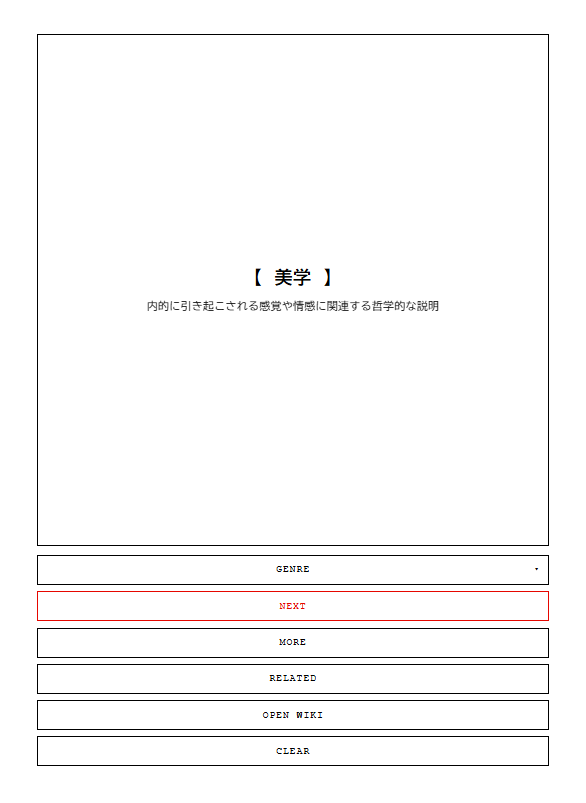

Siren Terminal

  

🔗 実行ページ

https://masato-nasu.github.io/SirenTerminal/

ブラウザ（Chrome / Edge / Safari 推奨）で開くと、PWA版 Siren Terminal が起動します。
スマートフォンでは「ホーム画面に追加」でインストールできます（オフライン動作可）。

スクリーンショット

  

使い方（最短）

画面が出たら NEXT（ランダム） を押します。
→ 1つ目のトピックが表示されます。

気になったら NEXT（関連） を押します。
→ 今のトピックに「つながる」別の1件が出ます。

詳しく読みたいときは MORE、閉じるときは BACK。

原典を開くときは OPEN WIKI。

任意の起点を作る（オプション）

上部の入力欄にキーワードを入れて OK を押すと、その内容から散歩が始まります。
※ 空のままでも利用できます。

よく使うボタン（要点）

NEXT（ランダム）：全く新しい話題へジャンプ

NEXT（関連）：いまの話題から1歩だけ関連へ

MORE / BACK：要約の展開／閉じる

OPEN WIKI：該当のWikipediaページを新規タブで開く

コツ

「ランダムで新規 → 関連で散歩」を繰り返すと、偶然と必然のバランスで気持ちよく広がります。

似た話題が続いた場合は ランダム で流れを切り替えると良いです。

困ったとき

反応が重い・おかしい：ページを再読み込み

直らない場合：ブラウザのキャッシュ消去後に再アクセス

概要

Siren Terminal は、Wikipedia から抽出された“概念”を ランダム と 関連 の2つの流れで辿る、最小限のセレンディピティ装置です。
ジャンルUIは排し、シンプルな操作で「知の散歩」を楽しめます。

主な機能（実装メモ）

NEXT（関連）＝ストリーム方式：
押すたびにその場で 1件だけ 関連を導出（先読みなし）。
優先順：Links → Prefix（前方一致） → Search。
内部状態（インデックス／オフセット）を localStorage に保持し、少しずつズレながら連鎖。

NEXT（ランダム）：新しい起点（seed）を作り、その後の関連探索が更新されます。

重複抑止（LRU）：既出タイトルを記録（既定200件）。

PWA対応：manifest.json / serviceWorker.js によりオフライン動作・強制更新。

ファイル構成
index.html         UI（入力欄 / ボタン / 詳細ビュー）
script.js          コアロジック（ランダム／関連ストリーム／LRU／JSONPユーティリティ）
manifest.json      PWA設定
serviceWorker.js   キャッシュと更新制御
assets/icon-*.png  アイコン
assets/screenshot.png スクリーンショット
